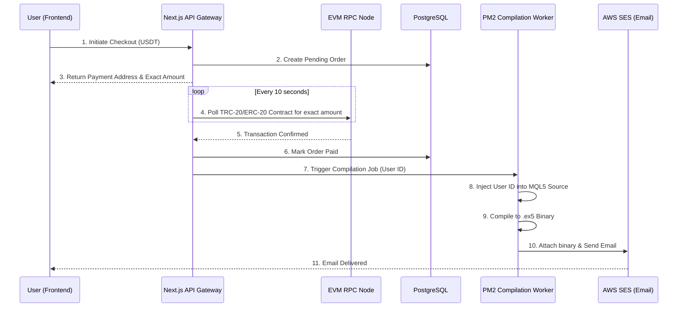

# VQuant Enterprise FinTech Architecture

A master architectural blueprint for an institutional Prop-Firm Risk Management ecosystem, detailing multi-chain treasury orchestration and Web3 SaaS integration. 

> **Disclaimer:** This repository contains the high-level architectural documentation and system design for the VQuant FinTech ecosystem. Source code is withheld due to proprietary trading algorithms and NDA constraints. Please view the [attached PDF Case Study](./Alpha_Finance_Case_Study.pdf) for exact UI/UX flows.

---

## 📌 1. System Overview

The Alpha Finance ecosystem is designed to bridge the gap between traditional quantitative trading (Prop-Firms) and decentralized finance (DeFi). The system provides a highly secure, zero-trust infrastructure for managing trader evaluations, algorithmic file fulfillment, and automated crypto payouts.

### Core Objectives:
1. **Zero-Trust Fulfillment:** Automatically compile and deliver encrypted MT5 trading bots (`.ex5`) only after on-chain crypto payment confirmation.
2. **Multi-Sig Treasury:** Secure all incoming client funds via Gnosis Safe smart contracts to prevent single-point-of-failure hacks.
3. **High-Frequency Scalability:** Handle thousands of concurrent Webhook events from MetaTrader 5 servers without dropping packets.

---

## 🏗️ 2. Architectural Data Flow

The following diagram illustrates the lifecycle of a user purchasing a trading algorithm and the system automatically compiling and delivering the file.

---

## 💻 3. Technology Stack

* **Frontend:** Next.js 14, TailwindCSS, Framer Motion
* **Backend:** Node.js, Express, PM2 (Process Manager)
* **Database:** PostgreSQL with Prisma ORM
* **Web3 Integration:** Ethers.js, Alchemy/Infura RPCs, Gnosis Safe SDK
* **Trading Integration:** MetaTrader 5 (MQL5), Webhook API
* **Cloud Infrastructure:** Ubuntu VPS, AWS SES (Email), AWS S3 (Artifact Storage)

---

## 🔐 4. Security & Risk Management

### Multi-Signature Treasury
To ensure institutional-grade security, all payments are routed to a **Gnosis Safe** smart contract rather than an Externally Owned Account (EOA).
* Requires 3-of-5 signatures from the executive board to move funds.
* Eliminates the risk of a single compromised private key draining the treasury.

### Anti-Piracy File Compilation
Trading algorithms (Expert Advisors) are never distributed as raw files. 
* Upon purchase, the Node.js worker dynamically alters the C++ / MQL5 source code, hardcoding the buyer's unique MT5 Account ID directly into the authorization function.
* The file is then compiled into a `.ex5` binary via a CLI compiler.
* If the user attempts to run the bot on an unauthorized account, the bot self-terminates.

---

## 📈 5. Business Impact

* **100% Automated Fulfillment:** Reduced manual customer support tickets regarding file delivery to zero.
* **0% Payment Gateway Fees:** By utilizing a custom TRC-20 polling daemon, the system bypasses Stripe/Coinbase Commerce fees, saving roughly 2.5% on every transaction.
* **Infinite Scalability:** The PM2 worker architecture allows the compilation queue to scale horizontally across multiple CPU cores during high-traffic launch days.
